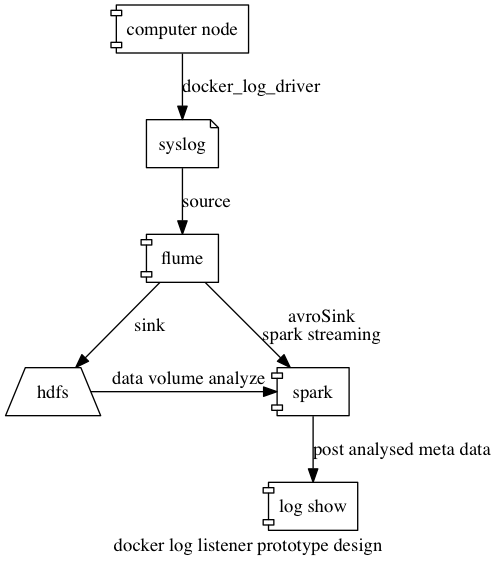

## 设计

1. 使用 docker 的 `--log-driver=syslog`，将日志采集到 syslog 中；
1. 使用 flume 对 syslog 作为 `source`
1. 将 syslog sink 到两个地方：
  1. `hdfs`：采用 spark 用作块分析
  1. `spark stream`：进行实时流分析

`flume` 这层可以用 `Kafka` 代替（[logging 收集](https://cwiki.apache.org/confluence/display/KAFKA/Ecosystem)）。

这样设计的目的的最佳好处是，整个日志收集与 `computer node` 的逻辑无相关，且不会有任何额外改动；同时，对于日志的分析，也能够按照不同的 spark 分析模块解耦合开来。

## 原型

### 硬件

`digitalocean`：2 GB Memory / 40 GB Disk / SFO1

> 注意：低于 2G 内存 spark 无法正常运行

### 部署

> 这里默认了 host ip 为 `172.17.0.1`

1. 启动 spark 的 spark flume streaming 进程：[README](spark/README.md)
1. 启动 flume：[README](flume/README.md)
1. 启动 fake_node_server：[README](fake_node_server/README.md)
1. 启动 log_show：[README](log_show/README.md)

### 输入与输出

输入见 [fake_node_server 接口](fake_node_server/README.md#usage-example)，在 `log_show` 上即可跟踪 `error`、`warn`、`info` 的产生情况。
